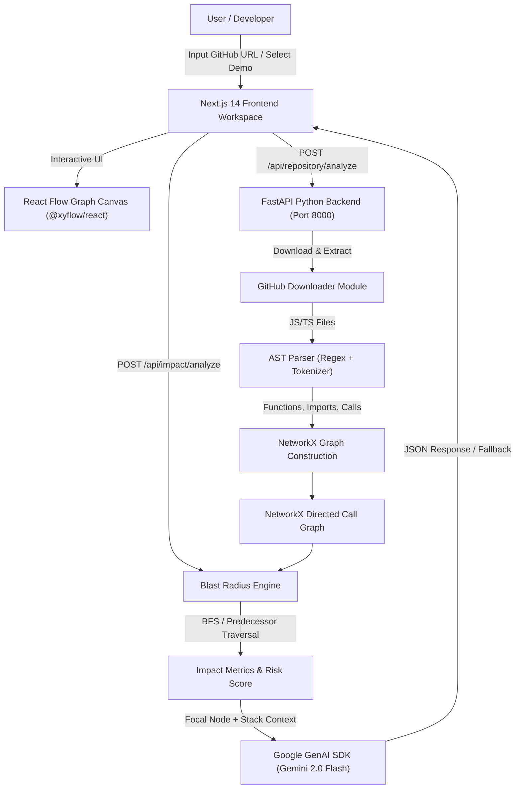

# Code Impact Mapper — System Architecture & Technical Specification

## 1. Executive Summary

**Code Impact Mapper** is a hackathon-ready developer tool that accepts a GitHub repository URL, performs automated AST static code analysis, constructs a NetworkX call dependency graph, and provides interactive visual blast radius calculations along with plain-language AI explanations for selected functions.

---

## 2. High-Level Architecture Diagram

---

## 3. Core Subsystems

### A. Repository Analysis & Downloader Module
- **GitHub Downloader** (`backend/app/analyzer/downloader.py`): Fetches public repository zip archives via GitHub API.
- **Directory Exclusion**: Ignores `.git`, `node_modules`, `dist`, `build`, `.next`, `__pycache__`, and test files (`.test.ts`, `.spec.ts`).
- **File Parsing**: Filters JavaScript (`.js`, `.jsx`, `.mjs`) and TypeScript (`.ts`, `.tsx`) source files up to 200KB per file.

### B. AST Parser & Function Extractor
- **Function Extractor** (`backend/app/analyzer/parser.py`): Extracts:
  - Standard Functions (`function foo() {}`)
  - Arrow Functions (`const foo = () => {}`)
  - Class Methods (`class Bar { baz() {} }`)
  - Parameters, Async status, Export flags, Line numbers, and Code Snippets.
  - Call Expressions (`callees`) to construct call site relationships.

### C. NetworkX Graph Representation
- **Graph Type**: Directed Graph `nx.DiGraph()`
- **Node Taxonomy**:
  - `repository`: Root repo node (`repo:owner/name`)
  - `file`: Source file path (`file:src/services/payment.ts`)
  - `function`: Function node ID (`src/services/payment.ts#processPayment`)
  - `module`: External import package node
- **Edge Taxonomy**:
  - `contains`: Repository $\rightarrow$ File, File $\rightarrow$ Function
  - `calls`: Function $\rightarrow$ Function (Caller to Callee execution flow)
  - `exports`: File $\rightarrow$ Function

### D. Blast Radius Traversal & Heuristic Risk Score Engine
- **Upstream Traversal**: Computes predecessors (direct callers at depth 1, transitive indirect callers at depth 2+).
- **Downstream Traversal**: Computes internal callees called by the target function.
- **Deterministic Heuristic Risk Score Formula**:
  $$\text{Score} = \min\left(100, \left(N_{\text{direct}} \times 15\right) + \left(N_{\text{indirect}} \times 8\right) + \left(D_{\text{max}} \times 10\right) + B_{\text{export}} + \left(\frac{N_{\text{total}}}{N_{\text{repo}}} \times 30\right)\right)$$
- **Severity Rating**:
  - `Critical`: Score $\ge 75$ or Impacted Callers $\ge 7$
  - `High`: Score $\ge 50$ or Impacted Callers $\ge 4$
  - `Medium`: Score $\ge 20$ or Impacted Callers $\ge 1$
  - `Low`: Score $< 20$

### E. AI Blast Radius Explanation Engine
- **Google Gen AI SDK**: Integrates with `gemini-2.0-flash` to return structured JSON containing:
  1. `functionPurpose`: Plain-English breakdown of function mechanics.
  2. `blastRadiusSummary`: Cascade impact explanation.
  3. `cascadeRisks`: List of potential downstream functional risks.
  4. `potentialBreakingChanges`: Signature & async contract risks.
  5. `recommendedTests`: Unit & integration testing checklist.
- **Graceful Fallback**: If `GEMINI_API_KEY` is not provided or API calls fail, the engine generates a local deterministic risk explanation so the user experience is never interrupted.

---

## 4. API Endpoints Specification

| Method | Endpoint | Description |
| :--- | :--- | :--- |
| `GET` | `/api/health` | Backend health check |
| `POST` | `/api/repository/analyze` | Clones/downloads GitHub repo, parses AST, and builds graph |
| `GET` | `/api/analysis/{analysis_id}` | Retrieves cached analysis graph session |
| `POST` | `/api/impact/analyze` | Calculates blast radius and requests AI explanation for selected function |

---

## 5. Security & Privacy
- Temporary repositories are extracted into isolated OS temp directories and purged immediately after analysis.
- API keys are handled via environment variables (`GEMINI_API_KEY`) or client-side header pass-through; keys are never stored on disk.
